# Bertrand's Paradox

*A Monte Carlo study of chord-length randomness and the non-uniqueness of "uniform random chord"*

**Author:** Himanshu Dubey  
**Date:** August 23, 2026  
**Last Updated:** 2026-08-31 01:48:25 IST

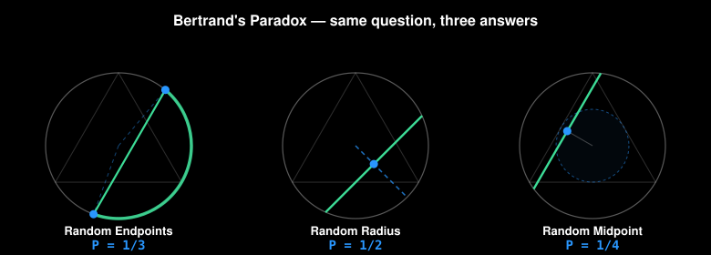

---

## Abstract

Bertrand's paradox, introduced by Joseph Bertrand in *Calcul des probabilités* (1889), asks a deceptively simple question: *what is the probability that a random chord of a circle is longer than the side of the inscribed equilateral triangle?* Three natural-seeming methods yield three incompatible answers — **1/3**, **1/2**, and **1/4** — none of which is "wrong." The paradox reveals a foundational fact of probability theory: "choose at random" is not a specification until a probability measure is named. This document formalizes each method, derives its exact probability, discusses the measure-theoretic origin of the disagreement, and describes an interactive simulator that reproduces all three results empirically.

**Keywords:** geometric probability, measure theory, Monte Carlo, Bertrand paradox, principle of indifference, maximum entropy.

---

## 1. Introduction

Given a circle of radius 1 and its inscribed equilateral triangle (side length √3), pick a chord "at random." With what probability does the chord exceed √3?

Bertrand's original observation was that three methods — each a defensible reading of "random chord" — give different probabilities. The resolution is not that two of them are wrong, but that the phrase *uniform random chord* is underspecified: different parameterizations of the space of chords induce different probability measures, and the three methods correspond to three genuinely different distributions. Modern treatments (Jaynes 1973, Marinoff 1994) show that one can privilege a method by imposing additional invariances, but without such a principle, all three are equally valid answers to distinct questions.

The paradox is more than a historical curiosity: it motivates the precise formulation of sample spaces in geometric probability, foreshadows the Borel–Kolmogorov paradox, and illustrates why the *principle of indifference* fails without a canonical parameterization.

---

## 2. Problem Statement

Let C be the closed unit disk centered at the origin, with boundary ∂C the unit circle. Let T ⊂ C be the inscribed equilateral triangle. A chord is any line segment whose endpoints lie on ∂C.

**Question.** For a "randomly chosen" chord ℓ, what is the probability that it exceeds the triangle side √3? A chord at perpendicular distance `d` from the center has length `2√(1 − d²)`, so the long-chord condition reduces to a single inequality on `d`.

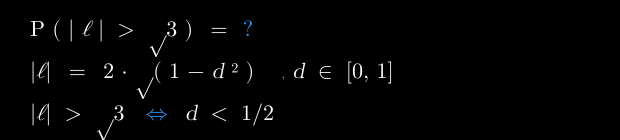

Three methods differ only in how they induce a distribution on `d` (or, equivalently, on the space of chords).

---

## 3. Method 1 — Random Endpoints (Answer: 1/3)

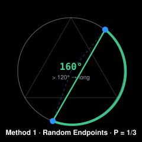

### 3.1 Construction
Choose two points independently and uniformly on ∂C. Let θ₁, θ₂ ~ Uniform[0, 2π) be their angles. The chord joins the two points.

### 3.2 Derivation
By rotational symmetry, set θ₁ = 0; the answer is unchanged. Let Δ ∈ [0, π] denote the *minor* central angle between the endpoints. With θ₂ uniform on [0, 2π), Δ is uniform on [0, π] with density 1/π, giving:

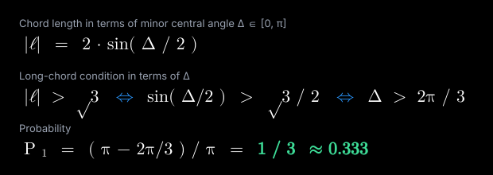

### 3.3 Geometric intuition
Condition on one endpoint; the second lies on the arc strictly further than 120° away iff it falls in the 120°-wide arc opposite the first endpoint. This arc spans 1/3 of the circle.

---

## 4. Method 2 — Random Radius (Answer: 1/2)

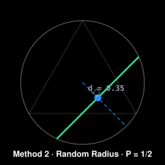

### 4.1 Construction
Choose a direction θ ~ Uniform[0, 2π) and a distance d ~ Uniform[0, 1] along that radius. The chord is perpendicular to the radius at the sampled point.

### 4.2 Derivation
Since d ~ Uniform[0, 1] by construction, the long-chord condition reads off immediately:

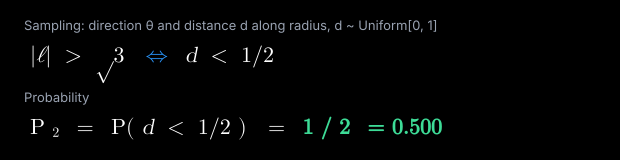

### 4.3 Geometric intuition
The chord's distance to the center is sampled linearly; half the time the point lies closer than 1/2, producing a long chord.

---

## 5. Method 3 — Random Midpoint (Answer: 1/4)

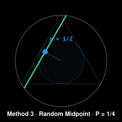

### 5.1 Construction
Choose the chord's midpoint M uniformly over the disk C. The chord is the one perpendicular to OM at M.

Uniform-over-area sampling requires `r = √U` with `U ~ Uniform[0,1]` (not `r ~ Uniform[0,1]`), to correct for the Jacobian `|r|` of polar area `dA = r dr dθ`.

### 5.2 Derivation
Let D = |OM|. Since M is uniform over the disk, P(long) equals the area ratio of the inner disk of radius 1/2 to the full disk:

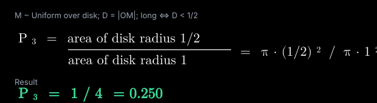

### 5.3 Distribution of D
For uniform-in-area sampling, D has density `2d` on [0, 1] — compare with [Method 2](#4-method-2--random-radius-answer-12), which puts `d ~ Uniform[0, 1]` (density 1). The two methods apply the **same geometric condition** (`d < 1/2`) to **different distributions**:

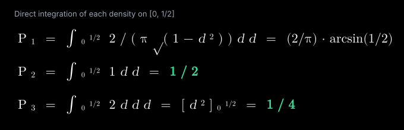

This is the crux: **different measures on the space of chords yield different answers to the same geometric question.**

---

## 6. Why Three Answers?

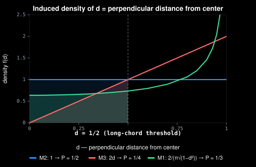

*The shaded area left of d = 1/2 under each curve equals that method's P(long chord). Three different densities on the same variable `d` → three different probabilities.*

The three methods parameterize the space of chords differently. Each sampling mechanism induces a different probability density on `d`:

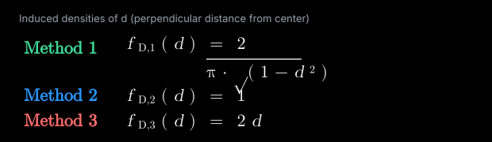

| Method | Random variable                    | P(long) |
|:------:|:-----------------------------------|:-------:|
| 1      | Two boundary points                | 1/3     |
| 2      | Direction + distance along radius  | 1/2     |
| 3      | Midpoint uniform over disk         | 1/4     |

Each measure is natural under different symmetries:

- **Method 1** is invariant under rotation of ∂C (the symmetry of the boundary).
- **Method 2** is invariant under rotation only.
- **Method 3** is invariant under rotation and respects the 2D Lebesgue (area) measure.

No single measure is "correct" from the bare problem statement. Bertrand's point was precisely that "at random" is an incomplete specification.

### 6.1 Jaynes' resolution
Jaynes (1973) argued that a well-posed problem should be invariant under all transformations that preserve the problem's physical specification — in particular, scale invariance and translation invariance on the plane (imagine throwing straws onto a circle drawn on paper; the probability should not depend on where the circle is drawn or how large it is). Under these invariances, only **Method 2** is admissible, yielding P = 1/2. This is a principled answer, but it requires an extra assumption that is not part of the original problem.

### 6.2 Connection to the Borel–Kolmogorov paradox
Conditional probabilities on measure-zero sets (e.g., "given the chord passes through this specific point") are not well-defined without specifying the limiting procedure. Bertrand's paradox is a finite-dimensional cousin: the conditioning event ("chord is long") is well-defined, but the *ambient measure* on chords is not canonical.

---

## 7. Monte Carlo Verification

For each method, draw N chords i.i.d. from the method's distribution and form the empirical proportion:

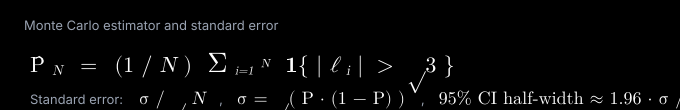

By the Strong Law of Large Numbers, `P̂_N → P` almost surely.

**Expected convergence behavior (confirmed empirically by [the simulator](#8-the-simulator)):**

| Method | Theoretical | N = 1,000        | `σ / √N` at N = 10,000 |
|:------:|:-----------:|:----------------:|:----------------------:|
| 1      | 0.3333      | ≈ 0.33 ± 0.03    | ≈ 0.0047               |
| 2      | 0.5000      | ≈ 0.50 ± 0.03    | ≈ 0.0050               |
| 3      | 0.2500      | ≈ 0.25 ± 0.03    | ≈ 0.0043               |

All three empirical probabilities stabilize within their respective confidence intervals after a few thousand samples.

---

## 8. The Simulator

This repository contains a single-file ([`index.html`](index.html)) mobile-first web application that:

1. Visualizes each method with a step-by-step animation of its random mechanism:
   - **Method 1**: two endpoint dots appear on ∂C, the minor arc is highlighted with its central angle in degrees, then the chord grows between the endpoints (colored green if arc > 120°, red otherwise).
   - **Method 2**: a dashed radius is drawn from the center, the midpoint dot is placed on the radius, and the perpendicular chord grows from it.
   - **Method 3**: the inner circle of radius 1/2 is shown as a dashed boundary, the midpoint pulses somewhere in the disk, and the perpendicular chord grows.
2. Provides **Run 1**, **Run 100**, **Run 1000**, and **Auto Run** controls to accumulate empirical probabilities.
3. Displays live statistics — trials, favorable, empirical probability, theoretical value.
4. Includes a **Compare All Three** mode that runs the three methods side-by-side on identical iteration counts, with each method animating its own mechanism simultaneously.

### 8.1 Implementation notes
- **Correct uniform-over-disk sampling** (Method 3): `r = √U`, `θ = 2π·U′`, with `U, U′` i.i.d. `Uniform[0,1]`. Using `r ~ Uniform[0,1]` would be Method 2, not Method 3.
- **Long-chord test**: computed directly from endpoint distance squared, `|ℓ|² > 3`, which avoids a square root per trial.
- **No backend, no dependencies**: pure HTML/CSS/JS; loads in under a second; works offline.

---

## 9. Discussion

Bertrand's paradox is a cautionary tale for anyone who invokes the principle of indifference ("all outcomes are equally likely") without specifying the sample space. It has influenced:

- The axiomatic treatment of probability (Kolmogorov 1933), which makes the probability space explicit.
- Modern geometric probability, where measures on spaces of lines, planes, and chords are specified via *invariance* arguments (e.g., the unique rotation-and-translation-invariant measure on lines in R², which agrees with Method 2).
- Bayesian priors and the construction of "noninformative" priors, which face analogous reparameterization issues.

The practical lesson for simulations, experiments, and statistical models: **always state the sampling mechanism explicitly**. "Uniformly random" is a contract between the problem-setter and the problem-solver; without agreement on the underlying measure, any answer is defensible — and none is uniquely correct.

---

## References

1. Bertrand, J. (1889). *Calcul des probabilités.* Gauthier-Villars, Paris. §4.5 (pp. 4–5).
2. Jaynes, E. T. (1973). "The Well-Posed Problem." *Foundations of Physics* **3** (4): 477–492. doi:10.1007/BF00709116.
3. Marinoff, L. (1994). "A Resolution of Bertrand's Paradox." *Philosophy of Science* **61** (1): 1–24.
4. Kolmogorov, A. N. (1933). *Grundbegriffe der Wahrscheinlichkeitsrechnung.* Springer.
5. Chiu, S. N.; Stoyan, D.; Kendall, W. S.; Mecke, J. (2013). *Stochastic Geometry and its Applications,* 3rd ed. Wiley.

---

## Appendix A — Density derivations (for d = perpendicular distance from center)

**Method 1.** Fix θ₁ = 0, θ₂ ~ Uniform[0, 2π). The chord midpoint is at distance `d = cos(Δ/2)` from the center, where Δ is the central angle. With Δ uniform on [0, π], apply the change-of-variables formula:

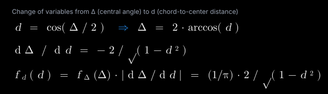

Check: `∫₀¹ 2 / (π · √(1 − d²)) dd = (2/π) · (π/2) = 1 ✓`.

**Method 2.** By construction, `d ~ Uniform[0, 1]`, so `f_d(d) = 1`.

**Method 3.** Uniform over disk: the CDF of D is `π·d² / π = d²`, so `f_D(d) = 2d`.

**Verification.** Direct integration of each density on [0, 1/2] recovers all three probabilities:


All three check against the geometric derivations in [§§3–5](#3-method-1--random-endpoints-answer-13).

---

## Running the Simulator

```bash
# No build step. No backend.
open index.html

# or serve locally:
python3 -m http.server 8000
# then visit http://localhost:8000
```

Optimized for mobile; fully functional on projector/desktop; share via QR code for audience participation.

---

*Same question. Three correct answers. The measure is the message.*
